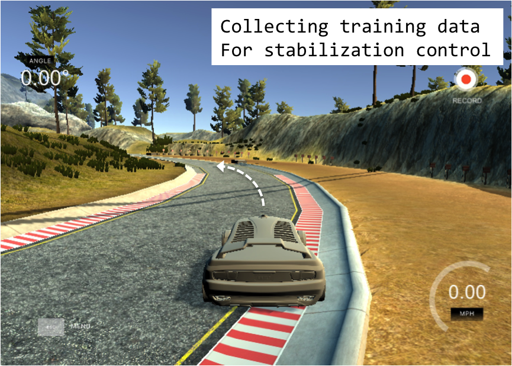
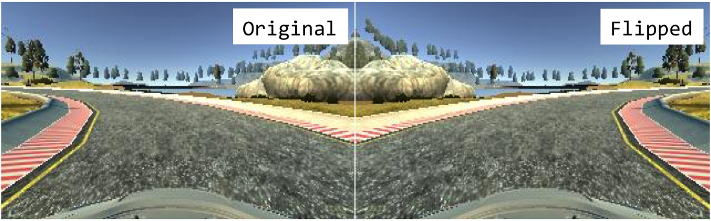

# **Behavioral Cloning**

### Record driving behavior in a simulator to train a neural network that drives the car autonomously.

The goals / steps of this project are the following:
* Use a simulator built on Unity to collect data of good driving behavior
* Design a convolutional neural network in Keras that predicts steering angles from images
* Train and validate the model on an Amazon EC2 instance
* Test that the model successfully drives around the track without leaving the road

### Files:

* See [model.py](https://github.com/evanloshin/CarND-Behavioral-Cloning-P3/blob/master/model.py) to view the pipeline that trains the model
* [model.h5](https://github.com/evanloshin/CarND-Behavioral-Cloning-P3/blob/master/model.h5) contains a trained Keras model
* Watch [video.mp4](https://github.com/evanloshin/CarND-Behavioral-Cloning-P3/blob/master/video.mp4) to see a recording of the car driving autonomously around the track

[//]: # (Image References)

[image1]: ./examples/placeholder.png "Model Visualization"
[image2]: ./examples/placeholder.png "Grayscaling"
[image3]: ./examples/placeholder_small.png "Recovery Image"
[image4]: ./examples/placeholder_small.png "Recovery Image"
[image5]: ./examples/placeholder_small.png "Recovery Image"
[image6]: ./examples/placeholder_small.png "Normal Image"
[image7]: ./examples/placeholder_small.png "Flipped Image"

---
## Approach

In industry, autonomous vehicle development takes one of two design approaches. Both approaches employ artificial intelligence to interpret the vehicle's environment. They diverge on how they use the resulting signals to make driving decisions. The first approach uses a modular machine learning architecture where AI is applied selectively and decision-making is largely defined explicity by the design team. The second approach, called behavioral cloning or imitation learning, applies end-to-end AI where policy is learned from sampling driving behavior.

To achieve a good result in this project, I begin by overtraining the model to quickly produce a working outcome. The simulator contains relatively consistent road textures and lane boundaries so the final result doesn't depend on the model's ability to generalize it's decision-making. Then, I experiment with a couple methods to reduce noise to get smoother autonomous steering behavior.

### Model Architecture

I use a network architecture previously published by NVIDIA's self-driving team in this [blog](https://devblogs.nvidia.com/deep-learning-self-driving-cars/) (model.py lines 121-130). There's benefit to starting with a proven architecture rather than re-architecting from scratch because the use cases are similar enough.

The data is normalized in the model using a Keras lambda layer (model.py line 119). Then, several convolutional layers are followed by a series of fully connected layers. I choose to activate each convolutional layer with the RELU function to introduce nonlinearity.

#### Attempts to reduce overfitting

Rather than implementing dropout layers, I take a different approach to reduce overfitting and use as few training laps around the track as possible. In this project, change in steering angle from frame to frame is a larger source of variation than the variety of terrain the camera sees.

Therefore, my pipeline calculates a moving average of the angle measurements from the training data (model.py lines 21-25, 39-42). I decided on this approach because of the simulator's high sensitivity to keyboard steering controls during training. Before conditioning, the recorded data would have one frame with a large angle measurement following by several frames with zero degree angles. With the noise eliminated, the result yielded smoother driving behavior.

I also implemented subsampling on the training data but ultimately commented out the code (model.py line 71). I discuss this decision in the section titled "Solution Design Approach".

#### Model parameter tuning

Aside from typical neural network hyperparameters such as batch size and optimizer, my model includes a couple other important variables. Those are number of periods for the moving average, sample rate, and image flip probability.
* **nb_periods** (model.py line xx) - The number of angle measurements following the current sample to average
* **sample_rate** (model.py line xx) - The decimal percentage of total samples to use for training
* **p_flip** (model.py line xx) - The probability of adding a flipped version of the sample image to the dataset

#### Training Strategy

I recorded a combination of center lane driving and recovering from the left and right sides of the road. Using the left and right cameras for training in addition to the center camera would make recovery data less important, but I choose the more expedient method here. Training the model on recovery data proved critical to completing a full lap around the track. Both cases serve to navigate the vehicle back to the lane's center, known as **stabalizing control**. Stabalizing control helps mitigate drift that builds up over time from small steering error.

Since the track contains mostly left turns, I also augment the training data with flipped images and additive inverse angles. This helps the model perform better on the map's one right turn.

#### Creation of the Training Set & Training Process

To capture good driving behavior, I recorded one lap around the track in each direction.

I then recorded the vehicle recovering from the left side and right sides of the road back to center. This image show what a recovery looks like starting from the right side:

After the collection process, I had 15,618 data points. Since the simulator outputs images in BGR color channels during training mode but outputs them in RGB during autonomous mode, I then preprocessed this data by converting images to RGB. This way, the model would train on images consistent with the ones it will predict.

To augment the data sat, I also flipped images and angles. Here is the result of flipping an image:

I finally randomly shuffled the data set and put 20% of the data into a validation set. The validation set helped determine if the model was over or under fitting. Only one epoch is used as evidenced by the increase in training and validation loss in every subsequent epoch. Finally, I use an adam optimizer to automatically tune the learning rate.

## Conclusion
The model performed as hoped for this project's limited scope. In practice, overfitting needs to be further minimized so the model can generalize it's behavior to unseen variations of the training data. This is especially true for fringe scenarios. For instance, training the model to avoid an object in the lane would be problematic if the type of object encountered differs from the one in training.

Data quantity is also an issue. Training a model on every inch of terrain at 30FPS requires staggering storage and time, even within a geofenced region. In practice, augmenting and running fewer "key" images through the model for a number of epochs is more practical. In fact, the model can be built to decide for itself which images are most important. This approach is called [active learning](http://slais.ijs.si/theses/2013-11-14-Mirchevska.pdf).

## References

Nvidia Architecture: https://devblogs.nvidia.com/deep-learning-self-driving-cars/

Active Learning: http://slais.ijs.si/theses/2013-11-14-Mirchevska.pdf

https://medium.com/@jmitchell1991/behavioral-cloning-self-driving-car-simulation-14531358c87e

https://medium.com/@fromtheast/you-dont-need-lots-of-data-udacity-behavioral-cloning-6d2d87316c52