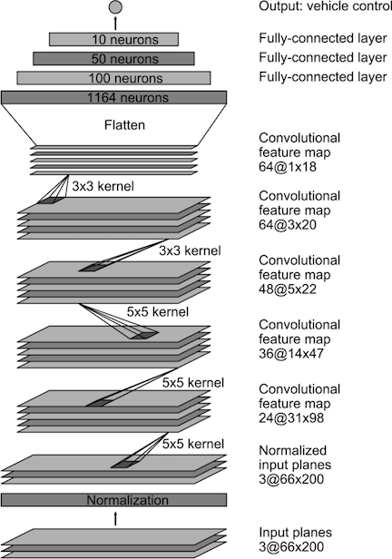

# **Behavioral Cloning**

### Intro: Record driving behavior in a simulator to train a neural network that drives the car autonomously.

The goals / steps of this project are the following:
* Use a simulator built on Unity to collect data of good driving behavior
* Design a convolution neural network in Keras that predicts steering angles from images
* Train and validate the model with a training and validation set
* Test that the model successfully drives around the track without leaving the road

### Files:

* See [model.py](https://github.com/evanloshin/CarND-Behavioral-Cloning-P3/blob/master/model.py) to view the pipeline that trains the model
* [model.h5](https://github.com/evanloshin/CarND-Behavioral-Cloning-P3/blob/master/model.h5) contains a trained Keras model
* Watch [video.mp4](NEED LINK) to see a recording of the car driving autonomously around the track
* [writeup.pdf](NEED LINK) is a pdf copy of this readme

[//]: # (Image References)

[image1]: ./examples/placeholder.png "Model Visualization"
[image2]: ./examples/placeholder.png "Grayscaling"
[image3]: ./examples/placeholder_small.png "Recovery Image"
[image4]: ./examples/placeholder_small.png "Recovery Image"
[image5]: ./examples/placeholder_small.png "Recovery Image"
[image6]: ./examples/placeholder_small.png "Normal Image"
[image7]: ./examples/placeholder_small.png "Flipped Image"

---
### Approach

In industry, approaches to behavioral cloning for self-driving cars varies. One common approach...

To achieve a good result in this project, I chose...

### Model Architecture

My model adopts a network architecture used by NVIDIA's self-driving team published in this [blog](https://devblogs.nvidia.com/deep-learning-self-driving-cars/) (model.py lines 121-130).

The data is normalized in the model using a Keras lambda layer (model.py line 119). Then, I choose to activate each convolutional layer with the RELU function to introduce nonlinearity. 

#### Attempts to reduce overfitting

Rather than implementing dropout layers, I took a different approach to reduce overfitting and use as few training laps around the track as possible.

My pipeline takes a moving average of the angle measurements from the training data (model.py lines 21-25, 39-42). I decided on this approach because of the simulator's high sensitivity to keyboard steering controls during training. Before conditioning, the recorded data would have one frame with a large angle measurement following by several frames with zero degree angles. With the noise eliminated, the result yielded smoother driving behavior.

I also implemented subsampling on the training data but ultimately commented out the code (model.py line 71). I discuss this decision in the section titled "Solution Design Approach".

#### Model parameter tuning

Aside from typical neural network hyperparameters such as batch size and optimizer, my model includes a couple other important variables. Those are number of periods for the moving average and sample rate. 

#### 4. Appropriate training data

Training data was chosen to keep the vehicle driving on the road. I used a combination of center lane driving, recovering from the left and right sides of the road ... 

For details about how I created the training data, see the next section. 

### Training Strategy

#### 1. Solution Design Approach

The overall strategy for deriving a model architecture was to ...

My first step was to use a convolution neural network model similar to the ... I thought this model might be appropriate because ...

In order to gauge how well the model was working, I split my image and steering angle data into a training and validation set. I found that my first model had a low mean squared error on the training set but a high mean squared error on the validation set. This implied that the model was overfitting. 

To combat the overfitting, I modified the model so that ...

Then I ... 

The final step was to run the simulator to see how well the car was driving around track one. There were a few spots where the vehicle fell off the track... to improve the driving behavior in these cases, I ....

At the end of the process, the vehicle is able to drive autonomously around the track without leaving the road.

#### 2. Final Model Architecture

The final model architecture (model.py lines 18-24) consisted of a convolution neural network with the following layers and layer sizes ...

Here is a visualization of the architecture (note: visualizing the architecture is optional according to the project rubric)

![alt text][image1]

#### 3. Creation of the Training Set & Training Process

To capture good driving behavior, I first recorded two laps on track one using center lane driving. Here is an example image of center lane driving:

![alt text][image2]

I then recorded the vehicle recovering from the left side and right sides of the road back to center so that the vehicle would learn to .... These images show what a recovery looks like starting from ... :

![alt text][image3]
![alt text][image4]
![alt text][image5]

Then I repeated this process on track two in order to get more data points.

To augment the data sat, I also flipped images and angles thinking that this would ... For example, here is an image that has then been flipped:

![alt text][image6]
![alt text][image7]

Etc ....

After the collection process, I had X number of data points. I then preprocessed this data by ...

I finally randomly shuffled the data set and put Y% of the data into a validation set. 

I used this training data for training the model. The validation set helped determine if the model was over or under fitting. The ideal number of epochs was Z as evidenced by ... I used an adam optimizer so that manually training the learning rate wasn't necessary.
